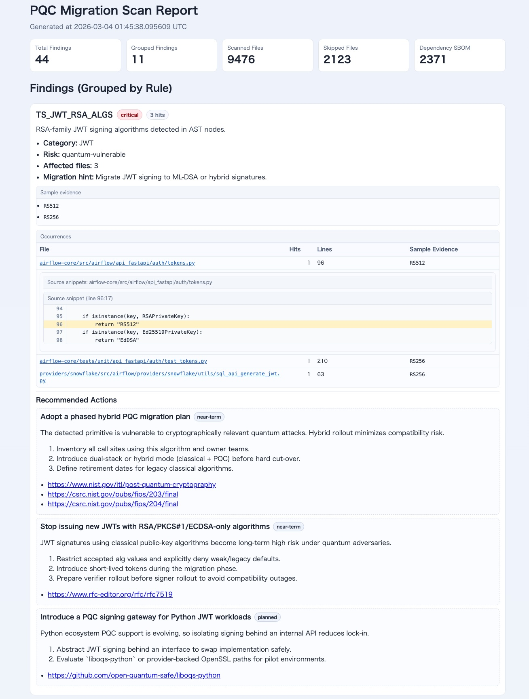

# pqc-scan - 耐量子暗号（PQC）スキャンツール

`pqc-scan` は、耐量子暗号（PQC）への移行準備を支援するRust製CLIです。  
リポジトリ内の暗号利用パターンをスキャンし、量子時代に関連するリスクを検出し、チーム向けに実行可能な移行レポートを生成します。

## このツールの目的

多くの組織ではソフトウェアサプライチェーン可視化のためにSBOMを導入していますが、PQC移行では **コードや設定における暗号利用の可視化** も必要です。  
`pqc-scan` は、トリアージ、計画策定、CIに使える実践的な出力でその可視化を提供します。

## クイックスタート

ご自身で利用されているプロダクトのリポジトリを以下のコマンドでスキャンします。

```bash
pqc-scan scan /path/to/your-product --format all --out-dir /path/to/your-product/pqc-report --rules-dir /path/to/pqc-scan/rules
```

生成されるファイル:

- `/path/to/your-product/pqc-report/report.json`
- `/path/to/your-product/pqc-report/report.html`
- `/path/to/your-product/pqc-report/report.md`
- `/path/to/your-product/pqc-report/report.sarif`
- `/path/to/your-product/pqc-report/cbom.json`
- `/path/to/your-product/pqc-report/dependency-sbom.json`

## インストール

### Option A: `pqc-scan` コマンドとしてインストール（推奨）

```bash
cd /path/to/pqc-scan
cargo install --path crates/pqc_scan_cli
```

その後、プロダクトリポジトリ側で実行します。

```bash
pqc-scan scan . --format all --out-dir ./pqc-report --rules-dir /path/to/pqc-scan/rules
```

インストール後に `pqc-scan: command not found` が表示される場合は、`~/.cargo/bin` が `PATH` に含まれているか確認してください。

### Option B: インストールせずに実行（ソースからの直接実行）

インストールせず試す場合は、ソースから直接実行できます。

```bash
cargo run --manifest-path /path/to/pqc-scan/crates/pqc_scan_cli/Cargo.toml --bin pqc-scan -- scan /path/to/your-product --format all --out-dir /path/to/your-product/pqc-report --rules-dir /path/to/pqc-scan/rules
```

## ツールの主な機能

- `tree-sitter` と `regex` を使ったハイブリッドな検出
- 重大度、信頼度、量子リスクタグのレポート出力
- 検出項目ごとの移行ガイダンス（ランタイム/言語に応じた推奨アクション）
- マッチ行をハイライトしたソーススニペット抽出（HTML + JSON）
- CBOMの出力（`cbom.json`）
- 依存関係インベントリの出力（`dependency-sbom.json`）
- GitHub Code Scanning向けSARIFを含むCI/CD向けの出力

## CBOM と SBOM の違い

| 成果物 | 目的 | 問い |
|---|---|---|
| `dependency-sbom.json` | ソフトウェア依存関係の棚卸し | 「どのパッケージ/ライブラリが含まれているか？」 |
| `cbom.json` | 暗号利用の棚卸し | 「どのアルゴリズム/暗号利用があり、量子リスクは何か？」 |

実務での使い分け:

- SBOMデータでコンポーネント/パッケージの露出を追跡する。
- CBOMデータで暗号移行作業（JWT/TLS/PKI/SSHなど）の優先度を決める。
- SBOMとCBOMを併用し、PQC移行計画を進める。

## 検出カバレッジ

### Detectorモジュール

- `tree_sitter_detector`
- `regex_detector`
- `dependency_detector`
- `certificate_detector`
- `key_detector`

### Tree-sitterの対応言語

- Java
- Go
- JavaScript
- TypeScript
- Python
- Rust
- Ruby

### 依存関係/マニフェストのファイル
以下の依存関係/マニフェストファイルをスキャンします。

- `Cargo.toml`, `Cargo.lock`
- `Gemfile`, `Gemfile.lock`, `gems.rb`, `gems.locked`, `*.gemspec`
- `pom.xml`, `build.gradle`, `build.gradle.kts`, `gradle.lockfile`
- `go.mod`
- `package.json`, `package-lock.json`, `pnpm-lock.yaml`
- `requirements.txt`, `Pipfile.lock`, `poetry.lock`

### SBOMファイル
下記フォーマットのSBOMをスキャンします。

- CycloneDX JSON（`*.cdx.json`, `*bom*.json`）
- SPDX JSON（`*.spdx.json`, `*sbom*.json`）

### 証明書/鍵ファイル
下記フォーマットの証明書や鍵ファイルをスキャンします。

- 証明書ファイル: `.pem`, `.crt`, `.cer`, `.der`, `.p12`, `.pfx`
- 秘密鍵のマーカー:
  - `BEGIN RSA PRIVATE KEY`
  - `BEGIN PRIVATE KEY`
  - `BEGIN OPENSSH PRIVATE KEY`

### 各種ミドルウェア設定
下記ミドルウェアの設定ファイルをスキャンします。

- Kubernetes / Ingress
- nginx
- Apache httpd
- Envoy
- Istio
- HAProxy
- Traefik

### 組み込みルールセット

- デフォルトルールは `rules/default/` 配下にあります。
- 現在の組み込みルール数: **100以上**

## CLI

CLIツールは以下の通り実行します。

```bash
pqc-scan scan <path> [--format json|html|md|sarif|all] [--out-dir ./pqc-report] [--rules-dir ./rules] [--fail-on high|critical] [--threads N]
pqc-scan rules list [--rules-dir ./rules]
pqc-scan rules show <rule-id> [--rules-dir ./rules]
```

### プロダクトリポジトリでの推奨実行方法

`pqc-scan` を自分のプロダクトリポジトリ内（`pqc-scan` リポジトリ外）で実行する場合は、`--rules-dir` に **絶対パス** を指定してください。

```bash
pqc-scan scan . --format all --out-dir ./pqc-report --rules-dir /path/to/pqc-scan/rules
```

### よく使うコマンド

```bash
# すべてのレポート形式を出力
pqc-scan scan . --format all --out-dir ./pqc-report --rules-dir /path/to/pqc-scan/rules

# SARIFのみ出力（GitHub Code Scanning向け）
pqc-scan scan . --format sarif --out-dir ./pqc-report --rules-dir /path/to/pqc-scan/rules

# CI失敗ゲート
pqc-scan scan . --fail-on high --rules-dir /path/to/pqc-scan/rules

# 1つのルール詳細を確認
pqc-scan rules show JWT_RS256 --rules-dir /path/to/pqc-scan/rules
```

## レポート出力

### `report.json`

機械出力したJSON形式のレポートです。検出結果、メタデータ、推奨アクション、ソーススニペットを含みます。

### `report.html`

人間にとってみやすいHTML形式のレポートです。以下を含みます。

- severityバッジ
- findingメタデータ
- ハイライト付きソーススニペット
- 推奨移行アクション

#### HTMLレポートのサンプル

以下のスクリーンショットは、実際の `report.html` 出力例です。  
ルール単位の集約表示、Occurrencesテーブル、ハイライト付きスニペット、Recommended Actions を確認できます。



### `report.md`

監査メモ、Pull Request、成果物保管に適したポータブルなテキスト形式のレポートです。

### `report.sarif`

コードスキャンプラットフォーム（GitHub Code Scanning 含む）向けのSARIF形式のレポートです。

### `cbom.json`

アルゴリズム/位置/リスク/移行方針を含むCBOM(Cryptographic Bill of Materials)です。

### `dependency-sbom.json`

マニフェストとSBOMファイルから抽出した依存関係インベントリです。

## セキュリティ/プライバシー制御

- 完全な秘密鍵情報は出力しません。
- 機微なスニペット出力はマスクします。
- リポジトリ走査時に `.gitignore` をチェックし記載のある成果物はスキャン対象外とします。
- デフォルト除外: `.git`, `node_modules`, `target`, `dist`はデフォルトでスキャン対象外とします。
- 2MB超のファイルはスキャン対象外とします。

## 精度と免責事項

`pqc-scan` は、ルールとヒューリスティクスに基づく **ベストエフォートな静的解析** を行います。  
トリアージと移行計画の高速化を目的としており、**形式的証明ツールではありません**。そのため、**100%の検出精度は保証できません**。

以下を前提に利用してください:

- 誤検知（False Positive）は発生し得ます。
- 見逃し（False Negative）は発生し得ます。
- 本番運用やコンプライアンス判断の前に、各環境での検証が必要です。

本ツールの結果は助言的な情報です。専門家レビュー、アーキテクチャ文脈、実行時/セキュリティ試験と組み合わせて評価してください。

## 既知の制約

- 静的スキャンのみでは、実行時の暗号ネゴシエーション経路を完全には推定できません。
- ライブラリ固有の挙動はバージョンや設定で変わる場合があります。
- 一部のパーサ非依存フォーマットはヒューリスティック検出であり、カスタムルールが必要になる場合があります。

## アーキテクチャ

ワークスペースクレート:

- `pqc_scan_cli`: CLI解析とコマンドディスパッチ
- `pqc_scan_core`: スキャンパイプライン、リスクエンジン、重複排除、推奨アクション付与
- `pqc_scan_rules`: YAMLルール読込とregexコンパイル
- `pqc_scan_detectors`: detector実装
- `pqc_scan_report`: JSON/HTML/Markdown/SARIF/CBOMライター

詳細は [docs/architecture.md](docs/architecture.md) を参照してください。

## GitHub Actions

サンプルワークフロー:

- `.github/workflows/pqc-scan.yml`

このワークフローは、スキャナーのビルド、SARIFスキャン出力、GitHub Code ScanningへのSARIFアップロード、および `dependency-sbom.json` のartifactアップロードを実行します。

## ライセンス

MIT
